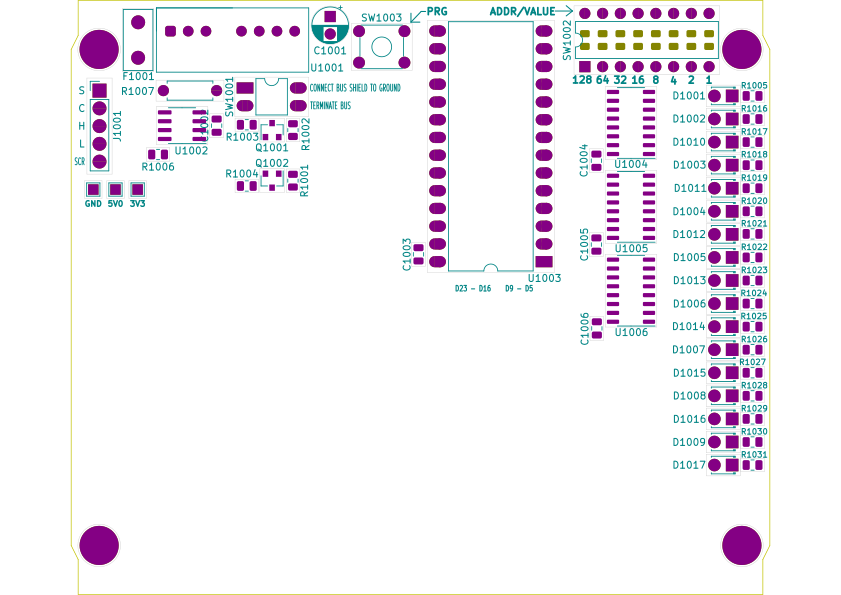

# NOP100/hardware

<table border="0px">
<tr>
<td>
This project thread provides a circuit design and PCB layout for a
generic, re-usable, NMEA 2000 module based around the Teensy 4.0
micro-controller.

The PCB layout can be imported into other projects, relieving them of
the effort of designing and implementing fundamental services which
power, interface, configure and process mostan NMEA module.
A project designer can import this PCB layout into their project and
focus on just those elements of design and implementation that are
appropriate to the development of their NMEA application.
</td>
<td colwidth="40%">

</td>
</tr>
</table>

See [NOP100/firmware](../firmware/) for a C++ pattern and associated
libraries that can be used as a basis for implementing firmware which
exploits this hardware design.

## Design elements

### PCB

The double-sided PCB is suitable for use in a
[case]()
and employs both surface-mount and through-hole components.

### Microcontroller

The project supports both Teensy 3.2 and Teensy 4.0 microcontroller
modules.

### Power supply

A TMR-2-2411 DC-DC converter takes bus power from NET-S/NET-C and
outputs a 5VDC 400mA supply for the PCB.

The converter power supply input is protected by a 0.25A
self-resetting polymer fuse selected on the assumption of a 12VDC
bus voltage.

Output from the converter is filtered through a smooting capacitor.

### CAN interface

An MCP-2551/IP CAN controller converts data on CAN-H/CAN-L to
signals suitable for microcontroller use. The signals are
level-shifted to 3.3VDC for compatability with the Teensy 4.0.

A switch switch-selectable 120 Ohm bus termination resistor allows
the module to be used as either an NMEA drop or terminal node.

### Configuration interface

The configuration interface consists of an SPST momentary tactile
switch (PRG) and a PISO connected 8-position DIL switch
(ADDR/VALUE).

### Display interface

The display interface consists of a single TRANSMIT_LED and up to 16
additional SIPO connected status LEDs for use by the host application.

## How to use this PCB design as the basis for a new project

The PCB design is simply imported into a new KiCad project and then
extended to provide the required application features.

1. Clone NOP100 into a local folder.

2. Open Kicad(1) and create a new project for your application.

3. Open pcbnew(1), choose FILE->MERGE, and select the
   ```NOP100.kicad_pcb``` file from the project downloaded at (1).

4. Choose FILE->SAVEAS, supply a filename which matches the name
   of the project you created at (2) and save the PCB layout.

## Things to consider when design your application

### Available power

The imported PCB provides ```+5V``` (from the onboard PSU at around
250mA), ```+3V3``` (from the Teensy DC-DC converter at around 40mA)
and ```GND```.

### Microprocessor GPIO voltage tolerances

If you use a Teensy 3.2 module then GPIO pins are 5VDC tolerant;
otherwise they are not and inputs voltages must be limited to
3.3VDC.

### Microprocessor GPIO connections

NOP100 makes available 13 GPIO pins (```D5``` through ```D9``` and
```D16``` through ```D23```).

Create connections to the GPIOs you need as micro-testpoints, label
them appropriately and make sure that each test point reference begins
with a '#' (his will stop KiCad requiring a footprint for the testpoint
which already exists (as a via) on NOP100).

