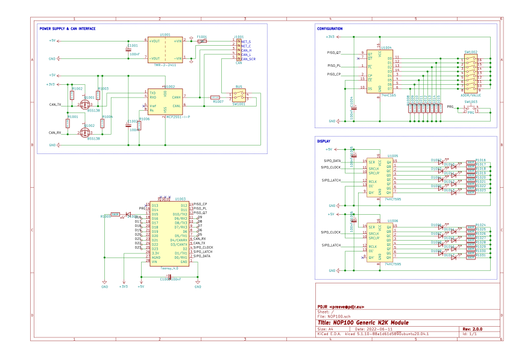

# NOP100/hardware

This project thread provides a circuit design and PCB layout for an
NMEA 2000 interface module which uses
[MikroBus](https://www.mikroe.com/mikrobus)
[Click](https://mikroe.com/click) cards as its real-world interfaces.
The module is based on the
[Teensy 4.0]()
micro-controller supported by a
[MCP2551]() CAN transceiver,
[Murata NCS1](power supplies)
and user configuration interface.

<table border="0">
<tr>
<td>

</td>
<td>

</td>
</tr>
</table>

See [NOP100/firmware](../firmware/) for a C++ pattern and associated
libraries that can be used as a basis for implementing firmware which
exploits this hardware design.

## Design elements

### PCB

The four-layer PCB is suitable for use in a
[Hammond 1591GSFLBK case](https://docs.rs-online.com/b790/A700000007521666.pdf)
and employs both surface-mount and through-hole components.

### Microcontroller

The project employs the
[Teensy 4.0](https://www.pjrc.com/store/teensy40.html) microcontroller module.

### Power supplies

Twin DC-DC converters take power from the NMEA bus (NET-S/NET-C) and
output 5VDC 200mA and 3.3VDC 250mA supplies.
The Teensy 4.0 on-board 3.3VDC output is not used.

### CAN interface

An MCP-2551/IP CAN transceiver converts data on the NMEA bus
(CAN-H/CAN-L) to signals suitable for use by the microcontroller CAN
interface.
The signals are level-shifted to 3.3VDC for compatability with the
Teensy 4.0.

A switch switch-selectable 120 Ohm bus termination resistor allows
the module to be used as either an NMEA drop or terminal node.
A second switch allows the NMEA bus shield to be connected to the
module GND.

An activity indicator LED shows when the CAN interface is transmitting.

### Configuration interface

The configuration interface consists of two 4-bit rotary switches which
are generally used to set the module's NMEA instance.
The rotary switches can also be used in concert with a momentary tactile
switch to save module configuration parameters to EEPROM.

### MikroBus sockets

The **NOP100** hardware is specialised by inserting appropriate MikroBus
Click modules into the two MikroBus connector sockets.
