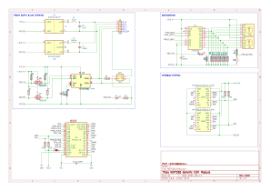

# NOP100 hardware

This project thread provides a circuit design and PCB layout for an
NMEA 2000 interface module which uses
[MikroBus](https://www.mikroe.com/mikrobus)
[Click](https://mikroe.com/click) cards as its real-world interfaces.

The module is based on the
[Teensy 4.0](https://www.pjrc.com/teensy_40)
micro-controller supported by an
[MCP2551](https://www.microchip.com/en-us/product/mcp2551)
CAN transceiver, and single or twin
[Murata](https://www.murata.com/en-eu/)
power supplies.

<table border="0">
<tr>
<td width="50%">

</td>
<td>

</td>
</tr>
</table>

See [NOP100/firmware](../firmware/) for a C++ pattern and associated
libraries that can be used as a basis for implementing firmware which
exploits this hardware design.

## Design elements

### PCB and enclosure

The four-layer PCB is suitable for use in a
[Hammond 1591GSFLBK case](https://docs.rs-online.com/b790/A700000007521666.pdf)
and uses both surface-mount and through-hole components.

### Microcontroller

[Teensy 4.0](https://www.pjrc.com/store/teensy40.html).

### Power supplies

The module is a dual-voltage (5VDC/3.3VDC) design and is powered from
the host NMEA bus 12VDC supply.

A DC-DC converter outputs 5VDC 400mA to the microcontroller and CAN
transceiver.
In situations where the installed MikroBus modules have a current draw
of less that 250mA the Teensy's on-board 3.3VDC voltage regulator can
be used as the supply for all 3.3VDC consumers by making a solder
bridge connection at JP1.

If the Teensy's 250mA limit is insufficient for MikroBus consumers,
then a 3.3VDC 600mA DC-DC converter can be installed on the module PCB
(in which case the solder-bridge connection must not be made).

### CAN interface

An MCP-2551/IP CAN transceiver converts data on the NMEA bus
(CAN-H/CAN-L) to signals suitable for use by the microcontroller CAN
interface.
Input and output signals are level-shifted to 3.3VDC for compatability
with the Teensy 4.0.

A switch switch-selectable 120 Ohm bus termination resistor allows the
module to be used as either an NMEA drop or terminal node and a second
switch allows the NMEA bus shield to be connected to the module GND.

An activity indicator LED shows when the CAN interface is transmitting.

### Configuration interface

The configuration interface consists of two 4-bit rotary switches, a
momentary tactile switch and an LED.
The rotary switches are used to set the module's NMEA instance but can
also be used in concert with the tactile switch to save module
configuration parameters to EEPROM.

### MikroBus sockets

The **NOP100** hardware is specialised by inserting appropriate MikroBus
Click modules into the two MikroBus connector sockets.
